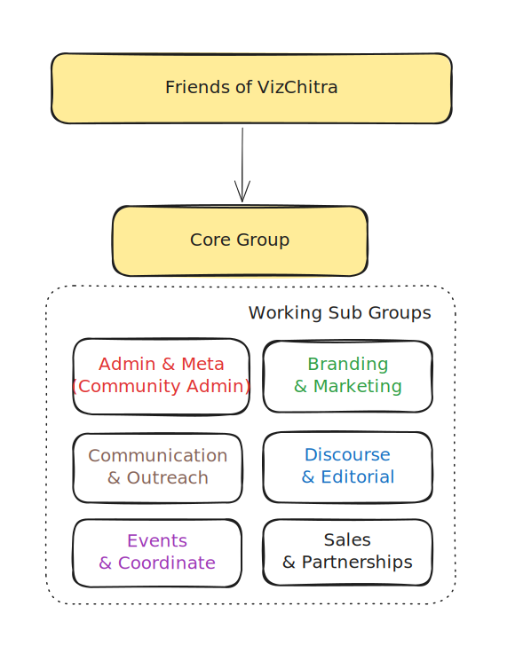

# Community Structure 

We follow a volunteer-led, flat membership structure for the community. Currently, there are two groups within the community - _Friends of VizChitra_ & _Core Members_:

1. **Friends of VizChitra**: This is an open membership group where people interested in the community can participate, exchange ideas and get involved. This is the entry point for new members to the community.

2. **Core Members**: These are active members of the community, who are **directly** engaged in driving the work in one of the six main workstreams of the community 
    - Admin & Meta
    - Branding & Marketing
    - Communication & Outreach
    - Discourse & Editorial
    - Events & Conference 
    - Sales & Partnership

**Community Admin**: Three members of the core team are nominated for being the community admin every year. They are the main leads on the _Admin & Meta_ teams. Their primary role involves taking care of the financial, legal, partnership and commnity membership and moderation issues. 
