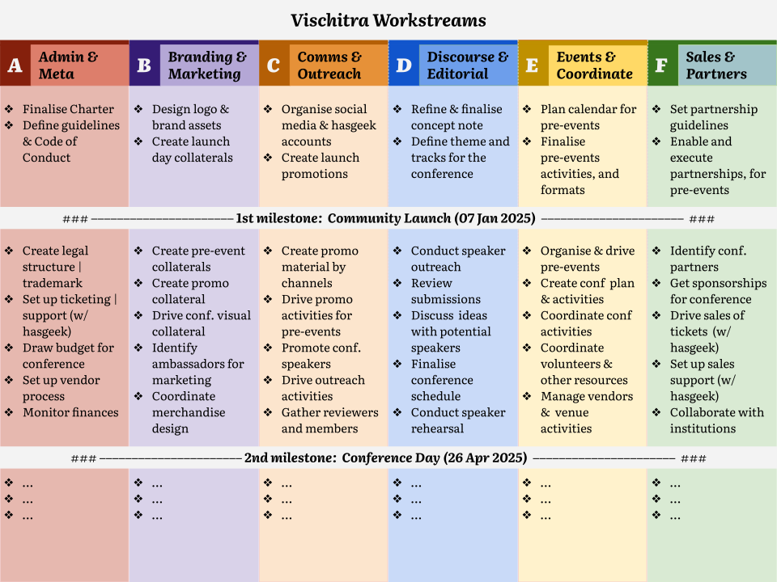

# Workstreams

## **Admin & Meta**

*To set the overall direction and coordinate the administration & structural activities for the community.*

* Launch Milestone \#1 (Nov – Dec)  
  * Finalise Charter  
    * About – Who we are / What we do |/Why do we exist / Who can participate  
    * Summary –  Mission / Vision / Members   
  * Define Community Guidelines  & Code of Conduct  
    * Ways of Working  
    * License & Copyright  
    * Code of Conduct / Moderation handling  
    * Guidelines  on promotion, seeking funding etc.  
* Conference Milestone \#2 (Jan–Apr)  
  * Create legal structure / trademark  
  * Set up ticketing / support (w/ hasgeek)  
  * Draw budget for conference   
  * Set up vendor process   
  * Monitor finances

## **Branding & Marketing**

*To create the brand voice and drive the overall marketing for the community.*

* Launch Milestone \#1 (Nov – Dec)  
  * Design logo & brand assets  
    * Design the community logo & keywords  
    * Set the visual theme and brand language  
  * Create visual design for launch collateral  
    * Make one page launch website @ vischitra.com   
    * Make initial launch community collateral  
* Conference Milestone \#2 (Jan–Apr)  
  * Create pre-event collaterals  
  * Create promotional collateral   
  * Drive conference-related visual collateral  
  * Identify ambassadors for marketing  
  * Coordinate merchandise design

## **Communication & Outreach**

*To communicate and drive the brand voice and drive the overall marketing for the community.*

* Launch Milestone \#1 (Nov – Dec)  
  * Organise social media & hasgeek accounts  
    * Set up the community account and profile page on hasgeek.com  
    * Set up socials accounts: Add logo / Add  byline / Add initial members / subscribers  
    * Hashtags to be used in the first 3-6 months  
  * Create launch promotion material & writeup  
    * Launch writeup for the community e.g. blog on the website  
    * Set the cadence and rhythm of  social promotional activities  
* Conference Milestone \#2 (Jan–Apr)  
  * Create promotions & outreach material for each channel  
  * Drive promotional activities for pre-events  
  * Promote community and speakers for the conference  
  * Drive outreach activities \- blogs, event summary, posts  
  * Gather reviewers and potential community members

## **Discourse & Editorial**

*To define the themes for the community discourse and drive the editorial process for the conference* 

* Launch Milestone \#1 (Nov – Dec)  
  * Refine & finalise concept note  
  * Define theme and tracks for the conference  
* Conference Milestone \#2 (Jan–Apr)  
  * Conduct speaker outreach  
  * Review conference submissions  
  * Discuss  ideas with potential speakers   
  * Prepare conference schedule  
  * Conduct speaker rehearsal

## **Events & Coordination** 

*To coordinate the pre-events, conference and post-events  and to grow the participation in the community* 

* Launch Milestone \#1 (Nov – Dec)  
  * Plan calendar for pre-events  
  * Finalise pre-events activities, and formats  
* Conference Milestone \#2 (Jan–Apr)		  
  * Organise & drive pre-events   
  * Create conference plan and activities  
  * Coordinate conference activities  
  * Coordinate volunteers and other resources  
  * Manage vendors and venue activities

## **Sales & Partnerships**

* Launch Milestone \#1 (Nov – Dec)  
  * Set partnership guidelines  
  * Enable and execute partnerships, for pre-events   
* Conference Milestone \#2 (Jan–Apr)  
  * Identify partners for the conference  
  * Get sponsorships for conference   
  * Manage & drive sales of  tickets / membership  (w/ hasgeek)  
  * Set up process for member accounts & support (w/ hasgeek)  
  * Collaborate with institutions (academic, professional/practice)  
* Post Conference (May onwards)  
* Maintain and update the list of partners   
* Engage and retain partnership  
* Identify and execute collaboration opportunities with community events 

## Reference
 - [Simplified Workstream - Google Doc Version](https://docs.google.com/document/d/1puyOXvela5CPJVWwbSLKoluEIjxlhA2EPD2UG6cRkeA/edit?usp=sharing)
 - [WorkStream Big Version by Zainab](https://docs.google.com/document/d/1xmkKsOxMszsNY2I8hKmLDSRdzZHJ1k-0S5oCNk0syvg/edit?tab=t.0#heading=h.f7veoewxt60t)